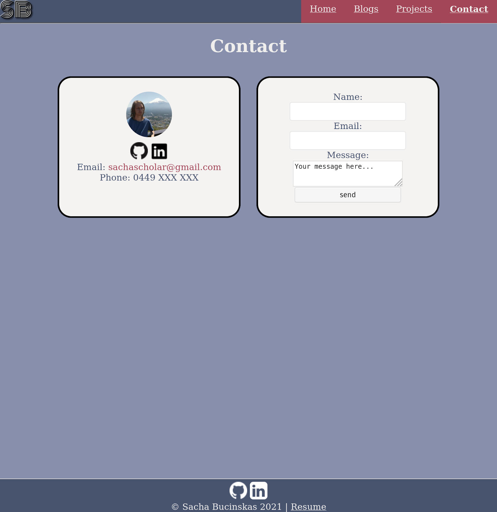
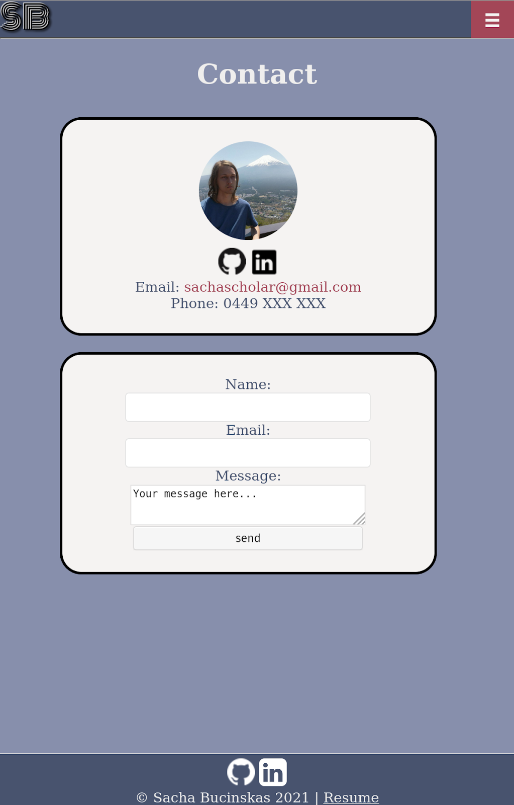

# Portfolio Website

[Live Website (Uses Github Pages)](https://sachabucinskas.github.io/Portfolio/)
[Git Repo (Uses Github)](https://github.com/SachaBucinskas/Portfolio)

## Description
This website covers my abilities & experience while demonstrating my ability with HTML/CSS for potential employers or anyone else interested

## Functionality / features
### Sitemap

### Menu
Made with pure HTML & CSS, displays a standard Menu on desktop, collapses into a Hamburger menu on mobile devices

Desktop

Mobile

### Home page
This page as with all pages on this site is largely formatted with flex boxes. On screens smaller than a large tablet, the article headings are moved above the main text

Desktop

Phone

Tablet

### Projects
A page covering my larger projects, with a medium sized overview & links to relevant blog posts/git repos. On mobile devices, the image on the left is moved above the articles rather than wrapping like desktop

Phone

Tablet

### Blog Overview
Fairly similar to the projects page, however the descriptions are shorter as this page contains all my articles & not a select few. Git repo links are also not directly provided as it's not relevant to all posts

Phone

Tablet

### Blog Article
A fairly simple blog article layout, title at the top, an image, then the main article & any necessary subheadings. Not much is done to specifically scale for mobile here outside of the usual hamburger menu

Phone

Tablet

### Contact
A contact page with my social media, email & phone number. There's also a form for sending an email, however it only currently forwards my email to the user's email client using mailto. The email form & information articles are moved into a column on smaller mobile devices

Phone

Tablet
